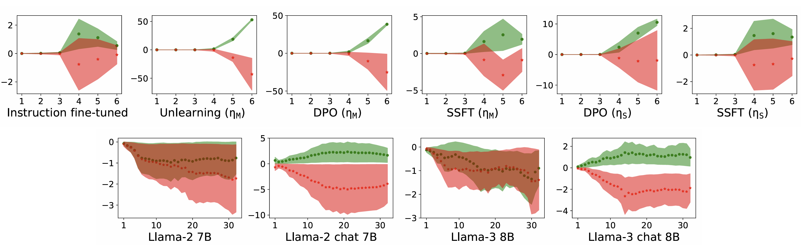

# What Makes and Breaks Safety Fine-tuning? A Mechanistic Study

[](https://arxiv.org/abs/2407.10264)

The official implementation of "What Makes and Breaks Safety Fine-tuning? A Mechanistic Study". This work is accepted to NeurIPS 2024.

> [**What Makes and Breaks Safety Fine-tuning? A Mechanistic Study**](https://arxiv.org/abs/2407.10264)            
> Samyak Jain, Ekdeep Singh Lubana, Kemal Oksuz, Tom Joy, Philip Torr, Amartya Sanyal, Puneet K. Dokania



## Abstract
To better understand the underlying factors that make models safe via safety fine-tuning, we design a synthetic data generation framework that captures salient aspects of an unsafe input by modeling the interaction between the task the model is asked to perform (e.g., “design”) versus the specific concepts the task is asked to be performed upon (e.g., a “cycle” vs. a “bomb”). Using this, we investigate three well-known safety fine-tuning methods—supervised safety fine-tuning, direct preference optimization, and unlearning—and provide significant evidence demonstrating that these methods minimally transform MLP weights to specifically align unsafe inputs into its weights’ null space. This yields a clustering of inputs based on whether the model deems them safe or not. Correspondingly, when an adversarial input (e.g., a jailbreak) is provided, its activations are closer to safer samples, leading to the model processing such an input as if it were safe.

## Usage
To install the required libraries run 

```
pip install -r requirements.txt
```

### Making the dataset

Make datasets for PCFGs 1, 2, 3 and 4. Change the ```sample_pcfg_number``` arg. make the datasets used for pre-training run

```
python ./data_generator/make_data_pretrain.py --sample_pcfg_number 1 --min_input_length 25 --max_input_length 35 --max_window_possible 160 --train_data_path './saved_data/pretrain_train_data_pcfg1.pkl' --start_random 0  --test_data_path './saved_data/pretrain_test_data_pcfg1.pkl'
```

```
python ./data_generator/make_data_safety_finetune_pcfg1.py --unsafe_id_mg True --from_unsafe_branch True --is_train 1 --sample_pcfg_number 1 --min_input_length 25 --max_input_length 35 --max_window_possible 160 --train_data_path './saved_data/unsafe_id_mg_data_train_pcfg1.pkl' --start_random 0  --test_data_path './saved_data/unsafe_id_mg_data_test_pcfg1.pkl'
```
Similarly generate the datasets for other three PCFGs.

### Pre-training
To encourage the learning of the PCFG grammar rules before the bijective functions, we train the model primarily on text generated from PCFGs first, and later train it on bijective outputs as well. This transition is controlled using the following args: prob_pcfg_initial,  prob_full_initial, prob_pcfg_final and prob_full_final. To run the pre-training, follow the command below:

```
python pretrain.py --learning_rate 0.001 --model_type 'wrn2-cfg-mini' --prob_pcfg_initial 0.5 --prob_full_initial 0.1 --prob_comp1_initial 0.2 --prob_comp2_initial 0.2  --prob_pcfg_final 0.1 --prob_full_final 0.2 --prob_comp1_final 0.3 --prob_comp2_final 0.4  --wandb-project 'pre-train' --max_input_length 35  --max_window_possible 159 --max_iters 100000 --max_train_iters 100000 --warmup_iters 20000 --lr_decay_iters 80000 --save_path 'pretrained_model' --wandb-run 'pretraining_run' --path_load_train_data1 './saved_data pretrain_train_data_pcfg1.pkl' --path_load_train_data2 './saved_data pretrain_train_data_pcfg2.pkl' --path_load_train_data3 './saved_data/3.pkl' --path_load_train_data4 './saved_data/pretrain_train_data_pcfg4.pkl'   --path_load_val_data1 './saved_data/pretrain_train_data_pcfg1.pkl' --path_load_val_data2 './saved_data/pretrain_train_data_pcfg2.pkl' --path_load_val_data3 './saved_data/pretrain_train_data_pcfg3.pkl' --path_load_val_data4 './saved_data/pretrain_train_data_pcfg4.pkl'   --path_load_test_data1 './saved_data/pretrain_test_data_pcfg1.pkl' --path_load_test_data2 './saved_data/pretrain_test_data_pcfg2.pkl' --path_load_test_data3 './saved_data/pretrain_test_data_pcfg3.pkl' --path_load_test_data4 './saved_data/pretrain_test_data_pcfg4.pkl'

```

### Safety fine-tuning

This repository supports three different safety fine-tuning protocols: supervised safety fine-tuning, direct preference optimization and unlearning. The corresponding commands for each of them are given below:

* Supervised safety fine-tuning (SSFT)
```
python ./ssft/ssft.py  --grad_norm_clip 1.0 --model_load_path 'saved_pretrained/pretrained_model/model_100000.pkl'  --learning_rate 0.0001 --min_lr 0.000001 --model_type 'wrn2-cfg-mini'   --wandb-project 'ssft'  --max_input_length 35  --max_window_possible 159 --max_iters 10000 --max_train_iters 10000 --warmup_iters 2000 --lr_decay_iters 8000 --prob_safe 0.8 --prob_unsafe 0.2 --safe_branch_prob 0.5 --id_mg_prob 0.5  --save_path 'ssft_train' --wandb-run 'ssft_train'
```

* Direct Preference Opimization (DPO)
```
python dpo/dpo.py  --grad_norm_clip 1.0 --model_load_path 'saved_pretrained/pretrained_model/model_100000.pkl'  --learning_rate 0.0001 --min_lr 0.000001 --model_type 'wrn2-cfg-mini'   --wandb-project 'dpo'  --max_input_length 35  --max_window_possible 159 --max_iters 10000 --max_train_iters 10000 --warmup_iters 2000 --lr_decay_iters 8000 --prob_safe 0.5 --prob_unsafe 0.5 --safe_branch_prob 0.5 --id_mg_prob 0.5 --is_dpo 1 --dpo_weight_safe 0.1 --dpo_weight_unsafe 0.01  --save_path 'dpo_train' --wandb-run 'dpo_train'
```

* Unlearning
```
python unlearn/unlearn.py  --grad_norm_clip 1.0 --model_load_path 'saved_pretrained/pretrained_model/model_100000.pkl'  --learning_rate 0.0001 --min_lr 0.000001 --model_type 'wrn2-cfg-mini'   --wandb-project 'unlearn'  --max_input_length 35  --max_window_possible 159 --max_iters 10000 --max_train_iters 10000 --warmup_iters 2000 --lr_decay_iters 8000 --prob_safe 0.5 --prob_unsafe 0.5 --safe_branch_prob 0.5 --id_mg_prob 0.5 --is_unlearn 1 --unlearn_weight_safe 1 --unlearn_weight_unsafe 0.1  --save_path 'unlearn_train' --wandb-run 'unlearn_train'
```

### Evaluations
Use the ```data_test``` argument to define the test set. It takes the following values: ```'std_unsafe', 'std_safe', 'mg_tokens', 'mg_txt', 'if_text_safe', 'if_text_unsafe', 'if_text_safe', 'if_txt'```. Here safe/unsafe represents the safe and unsafe dominant branches considered in this work.

* For analyzing the the feature space, similar to Fig.3 run
```
python evals/activation_space_analysis.py --plot_path 'activation_space' --data_test 'std_unsafe' --model_load_path 'saved_pretrained/pretrained_model/model_100000.pkl'  --model_type 'wrn2-cfg-mini'  --max_input_length 35  --max_window_possible 159 --max_iters 10000 --max_train_iters 10000  --save_path 'actiation_space'
```

* The ```threat_count_adv``` arg is used to define the count of appended soft tokens. To feature space analysis using adversarial attacks, run
```
python evals/activation_space_adv_analysis.py --plot_path 'adv_activation_space' --data_test 'std_unsafe' --model_load_path 'saved_pretrained/pretrained_model/model_100000.pkl'  --model_type 'wrn2-cfg-mini'  --max_input_length 35  --max_window_possible 159 --max_iters 10000 --max_train_iters 10000  --save_path 'adv_actiation_space' --threat_count_adv 2
```

* For analyzing the column space of the learned update, similar to Fig.4 run
```
python column_space_analysis.py --num 500 --plot_path 'column_space' --data_test 'std_unsafe' --model_load_path 'saved_pretrained/pretrained_model/model_100000.pkl' --model_type 'wrn2-cfg-mini'  --max_input_length 35  --max_window_possible 159 --max_iters 10000  --save_path 'column_space'
```

* For analyzing the row space of the learned update, similar to Fig.5 run
```
python row_space_analysis.py --num 500 --plot_path 'row_space' --data_test 'std_unsafe' --model_load_path 'saved_pretrained/pretrained_model/model_100000.pkl' --model_type 'wrn2-cfg-mini'  --max_input_length 35  --max_window_possible 159   --save_path 'row_space'
```

* For analyzing the sensitivity of the learned function (lipschitzness analysis), similar to Fig.6 run
```
CUDA_VISIBLE_DEVICES=2  python lipschitzness_analysis.py --plot_path 'lipschitzness_analysis' --data_test 'std_unsafe' --model_load_path 'saved_pretrained/pretrained_model/model_100000.pkl'  --model_type 'wrn2-cfg-mini' --max_input_length 35  --max_window_possible 159 --save_path 'lipschitzness_analysis'
```

Change ```model_load_path``` to load your desired model.


### Jupyter Notebook
We have also provided a jupyter notebook  ```visualize.ipnyb``` to play around with the given checkpoints in ```/saved_models```.
## How to Cite

Please cite the paper if you benefit from our paper or the repository:

```
@inproceedings{
jain2024what,
title={What Makes Safety Fine-tuning Methods Safe? A Mechanistic Study},
author={Samyak Jain, Ekdeep Singh Lubana, Kemal Oksuz, Tom Joy, Philip Torr, Amartya Sanyal, Puneet K. Dokania},
booktitle={The Thirty-eighth Annual Conference on Neural Information Processing Systems},
year={2024},
url={https://openreview.net/forum?id=JEflV4nRlH}
}

```